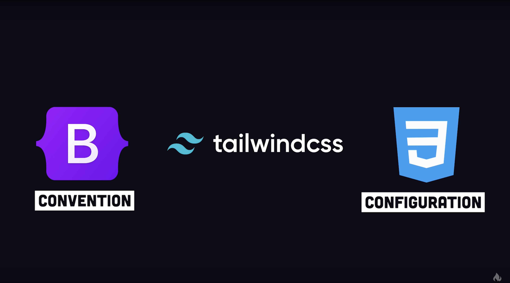

# Introduction

## A Bit of History: The Evolution of CSS and Front-End Development

  

Twenty years ago, CSS was a nascent technology, [a frontier for web developers and designers](https://www.webdesignmuseum.org/css-layout-pioneers/style-00s).
As [CSS began to gain widespread adoption](https://css-tricks.com/look-back-history-css/#aa-the-pioneers-of-standards-based-design),the landscape of front-end development was vastly different.
There were no established CSS libraries or frameworks to streamline the process.
Developers were tasked with building design systems from the ground up, meticulously crafting every style rule and component.

In the early 2010s libraries like [Twitter Bootstrap](https://getbootstrap.com/docs/5.3/about/overview/#history),
[Semantic UI](https://www.freecodecamp.org/news/semantic-ui-guide/), and [Foundation](https://get.foundation/showcase/about.html), marked a significant shift.
The era of bespoke design eventually gave way to the rise of [CSS toolkits and frameworks](https://bestofjs.org/projects?tags=css-lib).
These tools offered pre-built components and utility classes, dramatically accelerating development cycles.
They became essential for building front-end applications quickly and efficiently.

However, this rapid adoption came with its own set of challenges.
As these libraries became ubiquitous, a noticeable homogenization of web design occurred.
[Websites began to share a similar aesthetic, limiting creative expression](https://www.fastcompany.com/90501691/science-confirms-it-web-sites-really-do-all-look-the-same).
Companies and designers began demanding greater uniqueness to their brand identities in order to standout among a crowded, digital landscape.
However, developers struggled to deliver these unique designs because the rigid structure of traditional CSS toolkits made customization difficult and time-consuming.
Modifications often required extensive overrides and workarounds, leading to complex and hard-to-maintain codebases.

[This demand for flexibility and brand customization paved the way for the emergence of Tailwind CSS](https://www.youtube.com/watch?v=J_7_mnFSLDg).
Tailwind's utility-first approach revolutionized front-end development by providing developers with the tools
to easily implement brand guidelines and create unique designs without sacrificing performance or maintainability.
It offered a balance between the speed of pre-built components and the creative freedom of bespoke styling, empowering developers to craft truly distinctive user experiences.

## The State of Modern Front-End Development

  

UI libraries such as React and Vue have benefited from [a rich ecosystem of open-source component libraries](https://bestofjs.org/projects?tags=component),
significantly accelerating the development of design systems. However, while these libraries offer convenience,
[they often introduce performance concerns due to the increased size of bundled JavaScript and CSS](https://css-tricks.com/a-thorough-analysis-of-css-in-js/).

Furthermore, the front-end ecosystem is undergoing a significant shift towards server-side rendering, as exemplified by [React Server Components](https://react.dev/reference/rsc/server-components).
This transition is prompting developers and UI library authors to re-evaluate their reliance on client-side runtime styling solutions,
such as [styled-components](https://opencollective.com/styled-components/updates/thank-you), which are increasingly being deprecated in favor of more server-friendly approaches
such as [Panda CSS](https://panda-css.com/).

In this evolving landscape, the concept of "_Headless_" UI libraries has gained [considerable traction](https://npmtrends.com/@chakra-ui/react-vs-@mantine/core-vs-@mui/material-vs-@radix-ui/primitive).
Libraries like [Headless UI](https://headlessui.com/) pioneered the approach of providing fully accessible, unstyled UI components, empowering developers to apply their own styling solutions.
This philosophy reached widespread popularity with the emergence of [shadcn/ui](https://ui.shadcn.com/),
which leverages [Radix UI](https://www.radix-ui.com/) and [Tailwind CSS](https://tailwindcss.com/) to create accessible components in a distributed platform.

While shadcn/ui offers the advantage of code ownership and customization, it presents [a maintainence challenge](https://github.com/shadcn-ui/ui/issues/878): **Tailwind CSS utility classes can make component styling complex and difficult to work with**.
Existing libraries that work with Tailwind CSS, such as [class-variance-authority](https://cva.style/) and [tailwind-variants](https://www.tailwind-variants.org/),
address class management and variants, but they do not provide a programmatic solution for structuring styles based on the underlying headless design system's API.

This gap highlights the need for a more structured and programmatic approach to styling headless components, one that bridges the flexibility of Tailwind CSS with the data-driven nature of headless design systems.

## A Repo for Headless Design Systems

Project Jade Garden is a set of guides and tools to standardize development of Headless Design Systems.
This repo is primarly divided to two directories [`projects`](../projects) and [`tools`](../tools).

The `projects` directory acts as a documentation of popular and similar Headless component libraries' "_API_".
For example, child components for a parent component (accordion, dialog, menu, etc.) are referenced across these libraries as `anatomy`, `parts`, or `slots`.
While the authors of these libraries may not be talking to each other, the libraries they develop share a similar concept through implicit language.
In the very near future, the list of APIs can include [`ARIA attributes`](https://developer.mozilla.org/en-US/docs/Web/Accessibility/ARIA/Reference/Attributes) for accessiblity,
[`data attributes`](https://developer.mozilla.org/en-US/docs/Web/HTML/Reference/Global_attributes/data-*) for events and state in a component, and much more.
My hope is that at some point the authors will work to standardize their libraries to some common APIs, [similar to signals](https://github.com/transitive-bullshit/ts-reactive-comparison),
in an effort to improve the development experience and make it more easy to switch to another Headless component library if you're switching jobs or companies.

The `tools` directory includes the `jade-garden` library that is a collection of utilities to work with CSS classes
such as [clsx](https://github.com/lukeed/clsx), [cva](https://github.com/joe-bell/cva), and [Tailwind Variants](https://github.com/heroui-inc/tailwind-variants).
They have been modified to work with the ideas and standards of Project Jade Garden, which itself is greatly inspired by [Panda CSS](https://panda-css.com/docs/overview/why-panda) and [Tailwind CSS](https://tailwindcss.com/blog/tailwindcss-v4).
A core belief for Project Jade Garden is **Style Fast, Structure Smart, Simplify Later**:

- **Style Fast**: From an early concept, build as fast as possible and iterate often with collocated styles and markup.
- **Structure Smart**: When you or your team are satisfied with the design, restructure your classes for the sake of maintainability and extensibility.
- **Simplify Later**: When the design is established, move the collocated styles to CSS and delete the JavaScript that manages your classes.

The last point is especially important, as **_the intention of Project Jade Garden is to guide developers toward a CSS first solution_**, and to eventually make `jade-garden` **obsolete**.
To make this possible, `jade-garden` is [intended to work with Tailwind CSS](../tools/unplugin-jade-garden) without having to significantly re-invent the wheel.

The journey of CSS and front-end development reflects a constant evolution, a search for the right balance between speed, maintainability, and creative freedom.
My hope is that Project Jade Garden works with this evolution, aiming to further empower developers in their pursuit of crafting exceptional user experiences.
